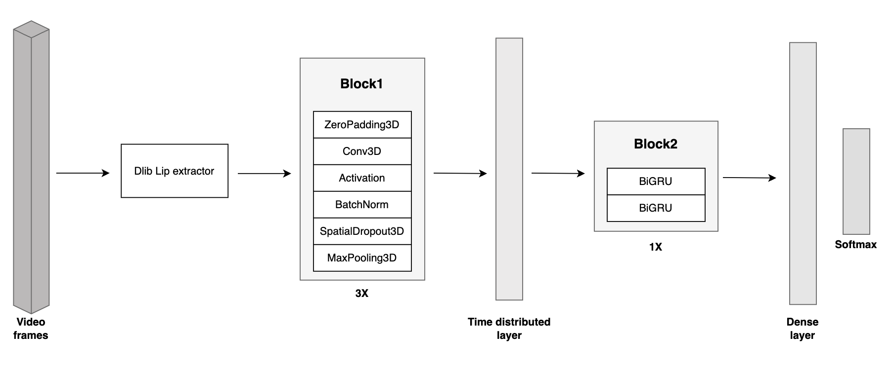
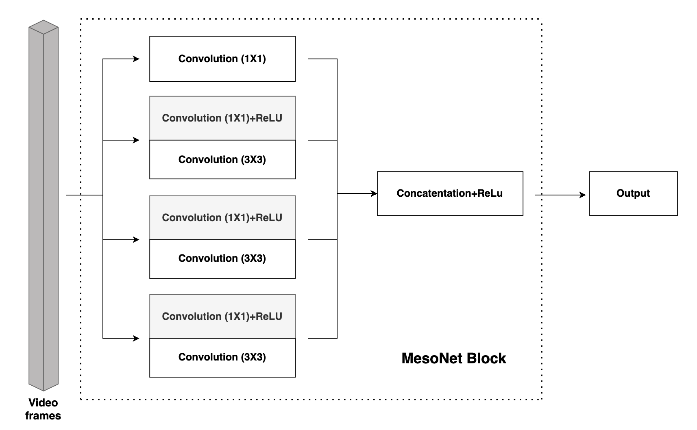
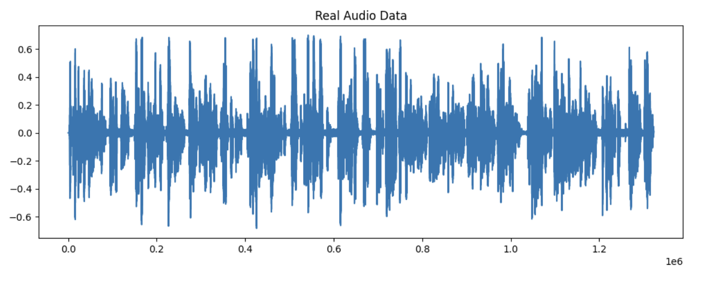
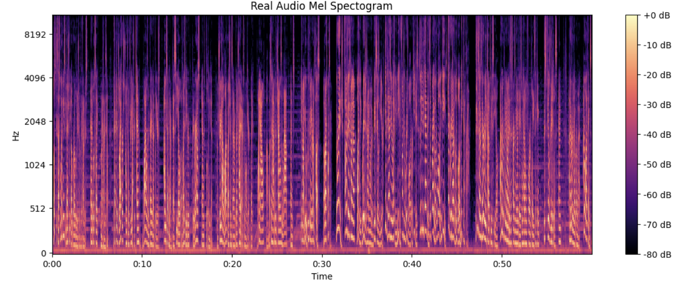
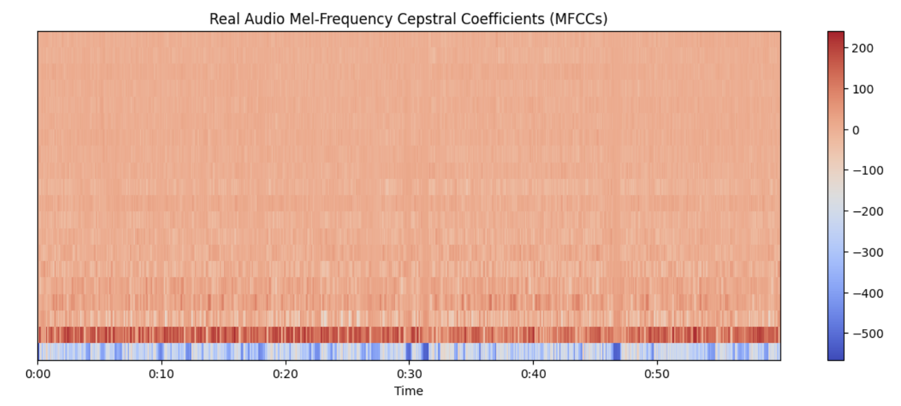

# Unfaked: Advanced Deepfake Detection with Explanatory Insights

The application runs in a development environment on port 3000 by default using the command `npm run dev`.

## Prerequisites
Before you begin, ensure you have the following installed:
- [Node.js](https://nodejs.org/) (version X.X.X or above)
- [npm](https://www.npmjs.com/) (comes with Node.js)
  
You can verify that both are installed by running:
bash
node -v
npm -v

## Introduction
Unfaked is an advanced deepfake detection framework designed to not only identify manipulated media but also explain why a video is classified as a deepfake. Leveraging state-of-the-art AI models, Unfaked goes beyond simple detection, offering detailed insights into the underlying reasons for the classification. This project integrates various deep learning techniques to provide a comprehensive and transparent analysis of video authenticity. 
  
Unfaked is particularly useful for researchers, developers, and organizations looking for reliable, explainable AI in the fight against media manipulation. By utilizing cutting-edge detection models and incorporating advanced visual and audio analysis, Unfaked stands out as a unique tool in the growing field of deepfake detection.

## AI Models Utilized in Unfaked

Unfaked employs a diverse set of AI models and techniques to ensure robust and reliable deepfake detection. Each model plays a critical role in analyzing different aspects of the video to provide a comprehensive evaluation:  

- **Forensic Analysis:** This model inspects inconsistencies in the visual data by detecting artifacts, compression issues, and irregularities in pixel distribution. It helps identify manipulated content by examining digital fingerprints left by deepfake generation methods.
  
- **LipNet:** LipNet is employed to perform lip reading, analyzing the synchronization between spoken words and lip movements. By comparing audio and visual cues, it identifies mismatches that may occur in deepfake videos where voice and lip movements are not aligned.
  

  
  

    <i>Figure 1: Custom-built Lipnet Architecture.</i>
  

- **MesoNet:** MesoNet is specifically designed for deepfake detection, focusing on mesoscopic properties of images. It analyzes subtle visual patterns that are typically invisible to the human eye but indicate tampered media.
    

  
  

    <i>Figure 2: Custom-built Mesonet Architecture.</i>
  

- **Gaze Tracker:** This model monitors the subject's eye movements, tracking irregularities in blinking patterns and gaze direction. Since deepfake models often struggle with replicating natural eye movements, the gaze tracker is an effective tool in detecting anomalies.
    

  
  

    <i>Figure 3:  Gaze-tracker Architecture.</i>
  

- **MFCC (Mel-frequency cepstral coefficients):** For audio analysis, Unfaked uses MFCC to detect deepfake audio by analyzing speech patterns, pitch, and frequency components. It identifies manipulated or synthetic audio elements that don't align with natural voice characteristics.

  
  
  

  <i>Figure 4: (Top Left to Right) Audio Sprectrogram, Audio Mel Spectrogram,(Bottom) Audio Mel-Frequency Cepstral Coefficients.</i>

